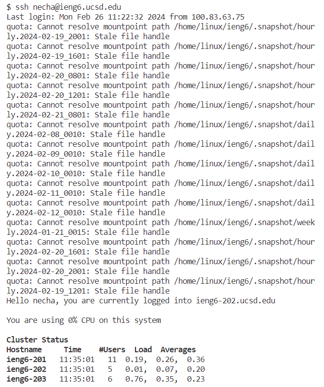
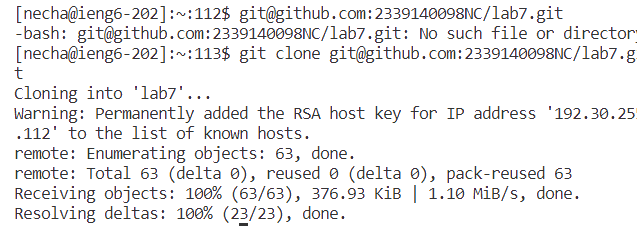
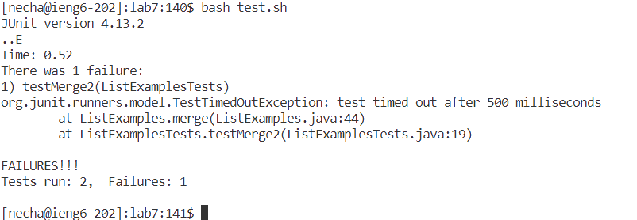
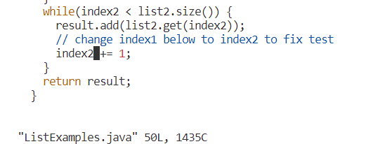
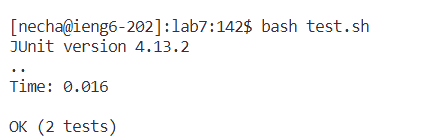
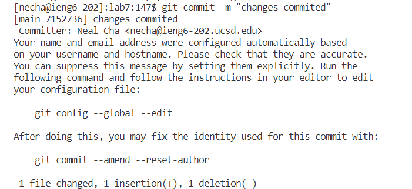
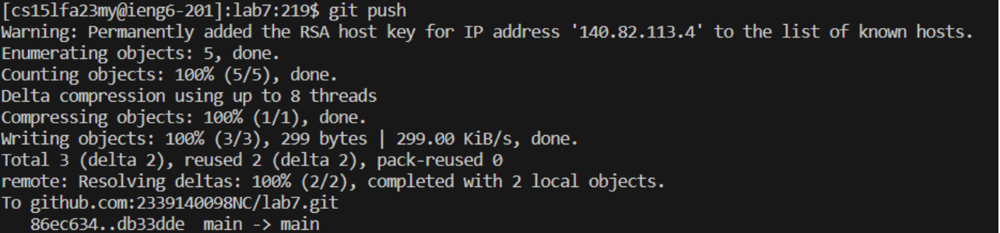

# Lab Report 4

## Section 1:  

- **Keypresses:** 
    - To reach this step, I pressed `ssh` > `necha@ieng6.ucsd.edu` > `<enter>`.
- **Commands and Effects:** 
    - log in to remote server without password

---

## Section 2:  

- **Keypresses:** 
    - To execute this, I used `git clone ` + `ssh link` + `<enter>`.
- **Commands and Effects:** 
    - clone the repository I forked to remote server with ssh link

---

## Section 3:  

- **Keypresses:** 
    - The sequence `bash test.sh` > `<enter>` 
- **Commands and Effects:** 
    - compile the program and run the tests, give feedbacks from those tests

---

## Section 4:  

- **Keypresses:** 
    - `vim <file name>``/change` >  `<enter>`, `<down>`, `<right>`, `<right>`, `<right>`, `1`, `<backspace>`, `2`, `<esc>`, `:wq`
- **Commands and Effects:**
    - `vim <filename>`
    - `/change` to locate to the position where it's closest to where the error is located
    - `i` to edit the file in vim to edit the file
    - `<esc>` to quit from editing
    - `:wq` save changes and quit vim

---

## Section 5:  

- **Keypresses:** 
    -  `bash test.sh` + `<enter>`.
- **Commands and Effects:** 
    - compile the program and run the tests, give feedbacks from those tests

---

## Section 6:  

- **Keypresses:** 
    - `git commit -m "commit message"` > `<enter>`.
- **Commands and Effects:** 
    - `git commit` : Captures the staged changes in the repository, creating a new commit with a descriptive message.

---

## Section 7:  

- **Keypresses:** 
    -  `git push` > `Key` was used.
- **Commands and Effects:** 
    - `git push`: Uploads all local branch commits to the remote repository, updating it with the local changes.

---

